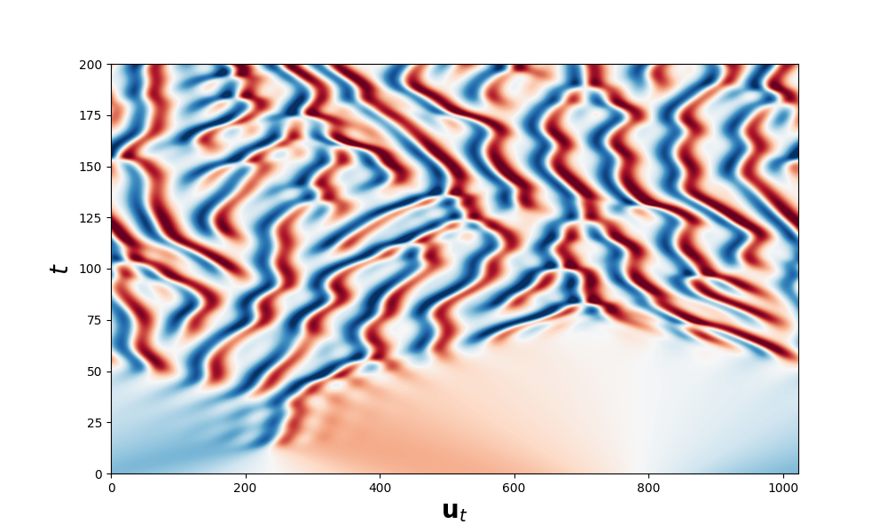

# One dimensional Kuramoto-Sivashinsky ETDRK4 solver


<p align="center">
  
</p>


This code solves the one-dimensional Kuramoto-Sivashisnky equation with periodic boundary condition
```math
\left\{
    \begin{array}{ll}
        \displaystyle \frac{\partial u}{\partial t} + \frac{\partial^{2} u}{\partial x^{2}} + \nu \frac{\partial^{4} u}{\partial x^{4}} + \frac{1}{2} \frac{\partial u^{2}}{\partial x} = 0 \\
        u(x+L,t) = u(x,t) \\
        x \in [0,L], L \in \mathbb{R}_{+}^{*} \\
        \nu \in ]0,1[ \\
        t \in \mathbb{R}_{+}
    \end{array}
\right. 
```
using spectral method with an ETDRK4 solver (as the equation is stiff). <br>


More precisly, since the solution u is $L$-periodic, we decompose it into a Fourier basis
```math
u(x,t) = \sum_{k \in \mathbb{Z}} \hat u_{k}(t)e^{i\frac{2\pi}{L}kx}
```
which leads to the following ODE
```math
\frac{d \hat u_{k}}{dt} = \left(q_{k}^{2} - q_{k}^{4}\right) \hat u_{k} - \frac{iq_{k}}{2} \mathcal{F} \Bigl[ \left(\mathcal{F}^{-1}[\hat u] \right)^{2} \Bigr]_{k}
```
where $\displaystyle q_{k} = \left(\frac{2\pi}{L}\right)k$ and $\displaystyle \mathcal{F}$ is the Fourier transform. <br>
The ODE is solved using an ETDRK4, which is particularly well suited to stiff equations. <br>

Moreover, the associated linear equation is also solved in tangent space, which allows to compute Lyapunov exponents and Covariant Lyapunov Vectors (CLV). An example is given in notebook.

### Contribute
If you find any error or bug in the code, do not hesitate to create an issue or a pull request.
